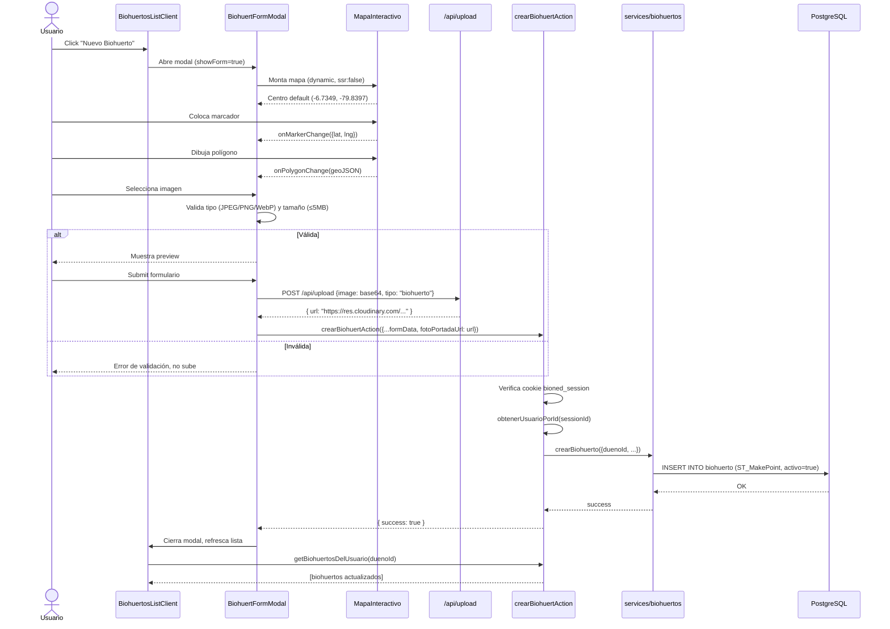
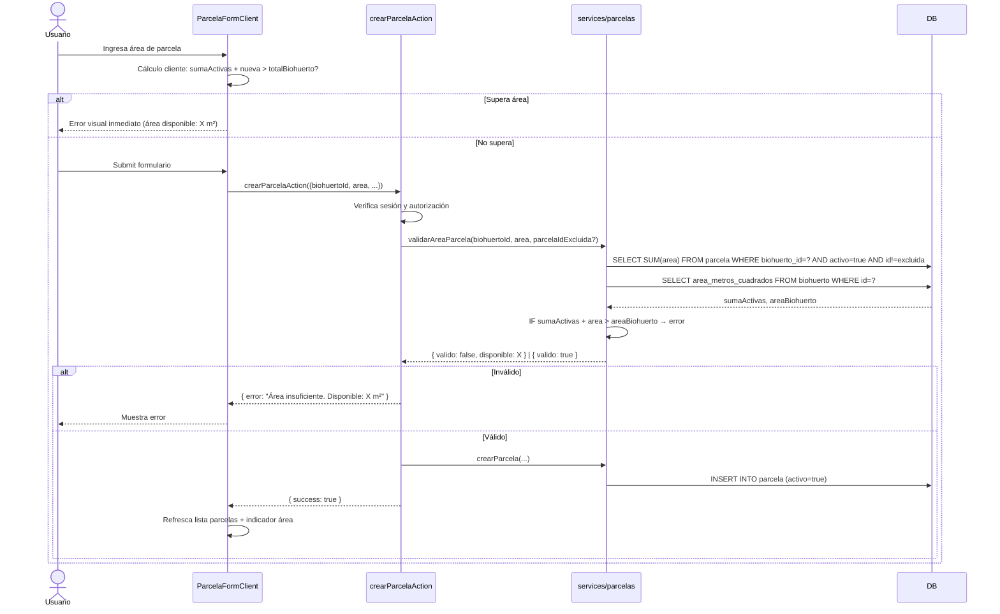

# Documento de Diseño Técnico — Gestión de Biohuertos y Parcelas

## Overview

Este documento describe el diseño técnico completo (alto y bajo nivel) para el módulo **GestorBiohuertos** de BioHuertosApp. El módulo permite a los usuarios productores crear, listar, editar y eliminar lógicamente sus Biohuertos y las Parcelas asociadas, con soporte de geolocalización interactiva vía Leaflet, subida de imágenes a Cloudinary y validación de áreas espaciales.

### Objetivos de Diseño

- Extender el schema de Prisma con eliminación lógica (`activo`, `fecha_eliminacion`) en `Biohuerto` y `Parcela`
- Implementar CRUD completo con Server Actions de Next.js, manteniendo la convención existente del proyecto
- Reutilizar y extender el patrón de `FarmMap.tsx` ya existente en marketplace para el nuevo `MapaInteractivo` editable
- Garantizar aislamiento de datos por `dueno_id` en todas las consultas
- Validar áreas de parcelas contra el biohuerto padre en servidor y cliente
- Soportar subida de imágenes al endpoint `/api/upload` existente con validación previa

### Contexto Tecnológico

- **Framework**: Next.js 16 (App Router) con TypeScript 5
- **ORM**: Prisma 7 + PostgreSQL con extensión PostGIS
- **Mapas**: Leaflet 1.9.4 (ya instalado)
- **Almacenamiento de imágenes**: Cloudinary SDK 2.10 (ya configurado)
- **Estilos**: Tailwind CSS 4
- **Gestor de paquetes**: pnpm
- **Autenticación**: Cookie `bioned_session` (verificada en middleware y Server Actions)

---

## Architecture

### Visión de Alto Nivel

```
┌─────────────────────────────────────────────────────────────────┐
│                         CLIENTE (Browser)                        │
│                                                                   │
│  /dashboard/biohuertos          /dashboard/biohuertos/[id]       │
│  ┌────────────────────┐         ┌────────────────────────────┐   │
│  │ BiohuertosPage     │         │ BiohuertDetailPage         │   │
│  │ (Server Component) │         │ (Server Component)         │   │
│  │ ┌──────────────┐   │         │ ┌──────────────────────┐   │   │
│  │ │BiohuertosLis-│   │         │ │BiohuertDetailClient  │   │   │
│  │ │tClient       │   │         │ │(Client Component)    │   │   │
│  │ │(Client Comp) │   │         │ │ ┌────────────────┐   │   │   │
│  │ │ ┌──────────┐ │   │         │ │ │ ParcelasClient │   │   │   │
│  │ │ │Biohuerto │ │   │         │ │ │ (Client Comp)  │   │   │   │
│  │ │ │FormModal │ │   │         │ │ └────────────────┘   │   │   │
│  │ │ └──────────┘ │   │         │ │ ┌────────────────┐   │   │   │
│  │ │ ┌──────────┐ │   │         │ │ │ MapaInterac-   │   │   │   │
│  │ │ │Biohuerto │ │   │         │ │ │ tivo (dynamic) │   │   │   │
│  │ │ │Card      │ │   │         │ │ └────────────────┘   │   │   │
│  │ │ └──────────┘ │   │         │ └──────────────────────┘   │   │
│  │ └──────────────┘   │         └────────────────────────────┘   │
│  └────────────────────┘                                           │
└─────────────────────────────────────────────────────────────────┘
          │                                │
          │ Server Actions                 │ Server Actions
          ▼                                ▼
┌─────────────────────────────────────────────────────────────────┐
│                      SERVIDOR (Next.js)                          │
│                                                                   │
│  src/actions/biohuertos.ts          src/actions/parcelas.ts      │
│  ┌──────────────────────────┐       ┌────────────────────────┐   │
│  │ getBiohuertosDelUsuario  │       │ getParcelasAction      │   │
│  │ getBiohuertoPorIdAction  │       │ crearParcelaAction     │   │
│  │ crearBiohuertAction      │       │ editarParcelaAction    │   │
│  │ editarBiohuertAction     │       │ eliminarParcelaAction  │   │
│  │ eliminarBiohuertAction   │       └────────────────────────┘   │
│  └──────────────────────────┘                                     │
│           │                                    │                  │
│           ▼                                    ▼                  │
│  src/lib/services/biohuertos.ts    src/lib/services/parcelas.ts  │
│  ┌──────────────────────────┐      ┌─────────────────────────┐   │
│  │ listarBiohuertosActivos  │      │ listarParcelasActivas   │   │
│  │ obtenerBiohuertoDetalle  │      │ crearParcela            │   │
│  │ crearBiohuerto (raw SQL) │      │ editarParcela           │   │
│  │ editarBiohuerto          │      │ eliminarParcelaLogico   │   │
│  │ eliminarBiohuerto        │      │ validarAreaParcela      │   │
│  └──────────────────────────┘      └─────────────────────────┘   │
│           │                                    │                  │
│           └──────────────┬─────────────────────┘                 │
│                          ▼                                        │
│               src/lib/db.ts (Prisma Client)                      │
│                          │                                        │
│                          ▼                                        │
│              PostgreSQL + PostGIS (Neon)                         │
└─────────────────────────────────────────────────────────────────┘
```

### Flujo de Datos — Diagrama de Secuencia (Creación de Biohuerto)



### Flujo de Datos — Validación de Área de Parcela



---

## Components and Interfaces

### Estructura de Directorios Propuesta

```
src/
├── actions/
│   ├── biohuertos.ts          # Extender con nuevas actions (editar, eliminar)
│   └── parcelas.ts            # NUEVO — actions CRUD para parcelas
├── app/(dashboard)/
│   └── biohuertos/
│       ├── page.tsx            # Server Component — carga inicial
│       └── [id]/
│           └── page.tsx        # Server Component — detalle con parcelas
├── components/
│   └── biohuertos/             # NUEVO — directorio de componentes del módulo
│       ├── BiohuertosListClient.tsx     # Orquestador Client del listado
│       ├── BiohuertCard.tsx             # Card individual de biohuerto
│       ├── BiohuertFormModal.tsx        # Modal formulario crear/editar biohuerto
│       ├── BiohuertDetailClient.tsx     # Orquestador Client del detalle
│       ├── ParcelasListClient.tsx       # Lista de parcelas con acciones
│       ├── ParcelaCard.tsx              # Item individual de parcela
│       ├── ParcelaFormModal.tsx         # Modal formulario crear/editar parcela
│       ├── AreaUsageIndicator.tsx       # Indicador de uso de área (m² y %)
│       ├── MapaInteractivo.tsx          # Componente Leaflet editable (client)
│       ├── ImageUploader.tsx            # Componente de subida de imagen con preview
│       └── ConfirmDialog.tsx            # Diálogo reutilizable de confirmación
├── lib/
│   └── services/
│       └── parcelas.ts         # NUEVO — queries de base de datos para parcelas
└── types/
    └── index.ts                # Extender con nuevos DTOs
```

### Especificación de Componentes

#### `BiohuertosListClient` (Client Component)

**Responsabilidad**: Orquestador del listado de biohuertos. Mantiene el estado local de la lista y coordina las acciones del usuario.

```typescript
interface BiohuertosListClientProps {
  biohuertos: BiohuertoDashboardDTO[];
  usuarioId: string;
}

// Estado interno:
// - biohuertos: BiohuertoDashboardDTO[]  (lista local, se actualiza optimísticamente)
// - showForm: boolean                    (modal de creación visible)
// - editingBiohuerto: BiohuertoDashboardDTO | null  (biohuerto en edición)
// - deletingId: string | null            (id en proceso de eliminación)
```

#### `BiohuertCard`

**Responsabilidad**: Tarjeta visual para un biohuerto individual.

```typescript
interface BiohuertCardProps {
  biohuerto: BiohuertoDashboardDTO;
  onEdit: (biohuerto: BiohuertoDashboardDTO) => void;
  onDelete: (id: string) => void;
}
```

#### `BiohuertFormModal`

**Responsabilidad**: Formulario modal unificado para crear y editar biohuertos. Integra `MapaInteractivo` e `ImageUploader`.

```typescript
interface BiohuertFormModalProps {
  biohuerto?: BiohuertoDashboardDTO;          // Si se pasa, modo edición
  onClose: () => void;
  onSuccess: (biohuerto: BiohuertoDashboardDTO) => void;
}

interface BiohuertFormState {
  nombreHuerto: string;
  descripcion: string;
  direccionTexto: string;
  areaMetrosCuadrados: string;
  lat: number | null;
  lng: number | null;
  poligono: [number, number][] | null;        // Vértices del polígono
  fotoPortadaUrl: string | null;
  fotoFile: File | null;                      // Archivo seleccionado para preview
}
```

#### `MapaInteractivo` (Client Component — carga dinámica)

**Responsabilidad**: Mapa Leaflet interactivo con soporte para marcador (punto GPS) y polígono dibujable.

```typescript
interface MapaInteractivoProps {
  initialLat?: number;
  initialLng?: number;
  initialPoligono?: [number, number][];
  onMarkerChange: (lat: number, lng: number) => void;
  onMarkerClear: () => void;
  onPolygonChange: (vertices: [number, number][]) => void;
  onPolygonClear: () => void;
  readonly?: boolean;             // Modo solo visualización (vista de detalle)
  className?: string;
}
```

**Notas de implementación**:
- Se importa con `next/dynamic(() => import("./MapaInteractivo"), { ssr: false })`
- Fix de íconos Leaflet: igual que `FarmMap.tsx`, se aplica `delete L.Icon.Default.prototype._getIconUrl`
- El CSS de Leaflet se carga con `<link rel="stylesheet" href="https://unpkg.com/leaflet@1.9.4/dist/leaflet.css" />`
- Modo polígono: click en el mapa agrega vértices, doble-clic cierra el polígono
- Modo marcador: click único en el mapa mueve el marcador

#### `ImageUploader`

**Responsabilidad**: Selector de imagen con validación (tipo y tamaño) y vista previa.

```typescript
interface ImageUploaderProps {
  currentUrl?: string | null;
  onImageReady: (base64: string) => void;
  onImageClear: () => void;
}

// Validaciones:
// - Tipos aceptados: image/jpeg, image/png, image/webp
// - Tamaño máximo: 5 * 1024 * 1024 bytes (5 MB)
// - Convierte el archivo a base64 para enviar al endpoint /api/upload
```

#### `AreaUsageIndicator`

**Responsabilidad**: Visualización del uso de área del biohuerto.

```typescript
interface AreaUsageIndicatorProps {
  areaTotal: number;          // area_metros_cuadrados del Biohuerto
  parcelasActivas: { areaMetrosCuadrados: number }[];
}

// Calcula: sumaUsada = sum(parcelas.area), porcentaje = (sumaUsada / areaTotal) * 100
// Muestra: barra de progreso + "X.XX m² usados de Y.YY m² (Z%)"
```

#### `BiohuertDetailClient` (Client Component)

**Responsabilidad**: Orquestador del detalle de un biohuerto. Muestra información completa, mapa readonly y gestión de parcelas.

```typescript
interface BiohuertDetailClientProps {
  biohuerto: BiohuertDetalleDTO;
}
```

#### `ParcelasListClient` (Client Component)

**Responsabilidad**: Lista de parcelas con acciones CRUD, integrada en la vista de detalle.

```typescript
interface ParcelasListClientProps {
  parcelas: ParcelaDashboardDTO[];
  biohuertoId: string;
  areaBiohuerto: number;
  onParcelasChange: (parcelas: ParcelaDashboardDTO[]) => void;
}
```

#### `ConfirmDialog`

**Responsabilidad**: Diálogo modal de confirmación reutilizable para eliminaciones.

```typescript
interface ConfirmDialogProps {
  open: boolean;
  title: string;
  message: string;
  onConfirm: () => void;
  onCancel: () => void;
  loading?: boolean;
}
```

---

## Data Models

### Cambios al Schema de Prisma

Se añaden los campos de eliminación lógica a los modelos `Biohuerto` y `Parcela`:

```prisma
model Biohuerto {
  id                  String                  @id @default(dbgenerated("gen_random_uuid()")) @db.Uuid
  duenoId             String                  @map("dueno_id") @db.Uuid
  nombreHuerto        String                  @map("nombre_huerto") @db.VarChar(100)
  descripcion         String?
  direccionTexto      String                  @map("direccion_texto")
  ubicacionGeo        Unsupported("geometry")
  areaGeografica      Unsupported("geometry")? @map("area_geografica") // NUEVO: Polygon
  areaMetrosCuadrados Decimal                 @map("area_metros_cuadrados") @db.Decimal(8, 2)
  fotoPortadaUrl      String?                 @map("foto_portada_url")
  activo              Boolean                 @default(true)            // NUEVO
  fechaEliminacion    DateTime?               @map("fecha_eliminacion") @db.Timestamptz(6) // NUEVO
  fechaCreacion       DateTime                @default(now()) @map("fecha_creacion") @db.Timestamptz(6)
  alertas             AlertaRecordatorio[]
  dueno               Usuario                 @relation(fields: [duenoId], references: [id], onDelete: Cascade)
  parcelas            Parcela[]
  finanzas            RegistroFinanciero[]

  @@map("biohuerto")
}

model Parcela {
  id                  String    @id @default(dbgenerated("gen_random_uuid()")) @db.Uuid
  biohuertoId         String    @map("biohuerto_id") @db.Uuid
  nombreIdentificador String    @map("nombre_identificador") @db.VarChar(100)
  areaMetrosCuadrados Decimal   @map("area_metros_cuadrados") @db.Decimal(8, 2)
  tipoSuelo           String?   @map("tipo_suelo") @db.VarChar(50)
  ubicacionGeo        Unsupported("geometry")? // NUEVO: Point opcional
  areaGeografica      Unsupported("geometry")? @map("area_geografica") // NUEVO: Polygon opcional
  activo              Boolean   @default(true)            // NUEVO
  fechaEliminacion    DateTime? @map("fecha_eliminacion") @db.Timestamptz(6) // NUEVO
  fechaCreacion       DateTime  @default(now()) @map("fecha_creacion") @db.Timestamptz(6)
  cultivos            Cultivo[]
  biohuerto           Biohuerto @relation(fields: [biohuertoId], references: [id], onDelete: Cascade)

  @@map("parcela")
}
```

**Script de migración SQL equivalente** (para referencia):
```sql
-- Migración: agregar eliminación lógica y columnas geoespaciales

ALTER TABLE biohuerto
  ADD COLUMN IF NOT EXISTS area_geografica geometry(Polygon, 4326),
  ADD COLUMN IF NOT EXISTS activo BOOLEAN NOT NULL DEFAULT TRUE,
  ADD COLUMN IF NOT EXISTS fecha_eliminacion TIMESTAMPTZ;

ALTER TABLE parcela
  ADD COLUMN IF NOT EXISTS ubicacion_geo geometry(Point, 4326),
  ADD COLUMN IF NOT EXISTS area_geografica geometry(Polygon, 4326),
  ADD COLUMN IF NOT EXISTS activo BOOLEAN NOT NULL DEFAULT TRUE,
  ADD COLUMN IF NOT EXISTS fecha_eliminacion TIMESTAMPTZ;
```

### DTOs de Transferencia (Client-Side)

Los Server Components leen de Prisma y serializan a estos tipos antes de pasar a Client Components (evitando objetos `Decimal` y `Date` no serializables):

```typescript
// src/types/index.ts — extensiones para este módulo

/** DTO para la card de listado de biohuertos */
export interface BiohuertoDashboardDTO {
  id: string;
  nombreHuerto: string;
  descripcion: string | null;
  direccionTexto: string;
  fotoPortadaUrl: string | null;
  areaMetrosCuadrados: number;        // Decimal → number
  fechaCreacion: string;              // Date → ISO string
  lat: number | null;                 // extraído de ubicacionGeo
  lng: number | null;                 // extraído de ubicacionGeo
  nParcelasActivas: number;           // count(parcelas activas)
}

/** DTO para la vista de detalle de un biohuerto */
export interface BiohuertDetalleDTO extends BiohuertoDashboardDTO {
  parcelas: ParcelaDashboardDTO[];
  poligono: [number, number][] | null; // vértices del area_geografica
}

/** DTO para un elemento de la lista de parcelas */
export interface ParcelaDashboardDTO {
  id: string;
  biohuertoId: string;
  nombreIdentificador: string;
  areaMetrosCuadrados: number;        // Decimal → number
  tipoSuelo: string | null;
  fechaCreacion: string;              // Date → ISO string
  lat: number | null;
  lng: number | null;
  poligono: [number, number][] | null;
  nCultivosActivos: number;
}

/** Payload para crear/editar biohuerto (Server Action) */
export interface BiohuertFormPayload {
  nombreHuerto: string;
  descripcion?: string;
  direccionTexto: string;
  areaMetrosCuadrados: number;
  lat?: number;
  lng?: number;
  poligono?: [number, number][];
  fotoPortadaUrl?: string;
}

/** Payload para crear/editar parcela (Server Action) */
export interface ParcelaFormPayload {
  biohuertoId: string;
  nombreIdentificador: string;
  areaMetrosCuadrados: number;
  tipoSuelo?: string;
  lat?: number;
  lng?: number;
  poligono?: [number, number][];
}
```

### Capa de Servicios — `src/lib/services/biohuertos.ts` (Extensiones)

Las funciones existentes (`listarBiohuertosDeUsuario`, `crearBiohuerto`, etc.) se reemplazan/extienden:

```typescript
/** Lista biohuertos activos de un usuario, ordenados por fecha_creacion DESC */
export async function listarBiohuertosActivosDeUsuario(
  duenoId: string
): Promise<BiohuertoDashboardDTO[]>

/** Obtiene el detalle completo de un biohuerto activo */
export async function obtenerDetallesBiohuerto(
  id: string,
  duenoId: string
): Promise<BiohuertDetalleDTO | null>

/** Crea un nuevo biohuerto usando $executeRaw para PostGIS */
export async function crearBiohuerto(data: {
  duenoId: string;
  nombreHuerto: string;
  descripcion?: string;
  direccionTexto: string;
  areaMetrosCuadrados: number;
  lat?: number;
  lng?: number;
  poligono?: [number, number][];
  fotoPortadaUrl?: string;
}): Promise<string>   // retorna el UUID del biohuerto creado

/** Actualiza un biohuerto existente (solo campos provistos) */
export async function editarBiohuerto(
  id: string,
  data: Partial<BiohuertFormPayload>
): Promise<void>

/** Eliminación lógica: activo=false, fecha_eliminacion=NOW() + cascada a parcelas */
export async function eliminarBiohuerto(id: string): Promise<void>
```

### Capa de Servicios — `src/lib/services/parcelas.ts` (Nuevo)

```typescript
/** Lista parcelas activas de un biohuerto */
export async function listarParcelasActivas(
  biohuertoId: string
): Promise<ParcelaDashboardDTO[]>

/** Valida que el área propuesta cabe en el biohuerto padre */
export async function validarAreaParcela(
  biohuertoId: string,
  areaMetrosCuadrados: number,
  parcelaIdExcluida?: string     // ID de la parcela en edición (se excluye del cálculo)
): Promise<{ valido: boolean; disponible: number }>

/** Crea una nueva parcela */
export async function crearParcela(data: ParcelaFormPayload): Promise<string>

/** Actualiza una parcela existente */
export async function editarParcela(
  id: string,
  data: Partial<ParcelaFormPayload>
): Promise<void>

/** Eliminación lógica de parcela */
export async function eliminarParcela(id: string): Promise<void>
```

---

## Correctness Properties

*Una propiedad es una característica o comportamiento que debe cumplirse en todas las ejecuciones válidas de un sistema — esencialmente, un enunciado formal sobre lo que el sistema debe hacer. Las propiedades sirven como puente entre especificaciones legibles por humanos y garantías de corrección verificables automáticamente.*

### Property 1: Aislamiento de Datos por Usuario — Solo Activos

*Para cualquier* usuario autenticado `U` y cualquier conjunto de biohuertos en la base de datos (activos/inactivos, propios/ajenos), la función `listarBiohuertosActivosDeUsuario(U.id)` debe retornar exclusivamente los biohuertos donde `dueno_id = U.id` Y `activo = true`. Ningún biohuerto con `activo = false` ni de otro usuario debe aparecer en el resultado.

**Validates: Requirements 2.1, 5.3, 14.5**

---

### Property 2: Ordenamiento de Listado por Fecha

*Para cualquier* lista de biohuertos activos de un usuario con N ≥ 2 elementos, la lista retornada por `listarBiohuertosActivosDeUsuario` debe estar ordenada de forma que para todo par de elementos consecutivos `(i, i+1)`, se cumpla `biohuertos[i].fechaCreacion >= biohuertos[i+1].fechaCreacion`.

**Validates: Requirements 2.5**

---

### Property 3: Invariante de Creación — Campos de Estado Correctos

*Para cualquier* payload de creación válido de Biohuerto `P` enviado por un usuario autenticado `U`, el registro persistido en la base de datos debe satisfacer simultáneamente: `activo = true`, `dueno_id = U.id` y `fecha_eliminacion = NULL`.

**Validates: Requirements 3.6**

---

### Property 4: Invariante de Creación de Parcela — Campos de Estado Correctos

*Para cualquier* payload de creación válido de Parcela `P` para un biohuerto `B`, el registro persistido debe satisfacer: `activo = true`, `biohuerto_id = B.id` y `fecha_eliminacion = NULL`.

**Validates: Requirements 8.3**

---

### Property 5: Validación de Nombre — Biohuertos y Parcelas

*Para cualquier* cadena `s`, la función de validación de nombre debe retornar "válido" si y solo si `s` no es vacía (después de trim) y `len(s) <= 100`. Para cualquier `s` vacía o con solo espacios en blanco, o cualquier `s` con `len(s) > 100`, la función debe retornar "inválido" con mensaje de error descriptivo.

**Validates: Requirements 3.7, 8.4**

---

### Property 6: Validación de Área — Valor Positivo

*Para cualquier* valor `a` de área en metros cuadrados, la función de validación debe retornar "válido" si y solo si `a > 0`. Para cualquier `a ≤ 0` o `a` no numérico (NaN, Infinity), debe retornar "inválido" con mensaje de error descriptivo.

**Validates: Requirements 3.8, 8.5**

---

### Property 7: Validación de Área de Parcela vs. Biohuerto

*Para cualquier* biohuerto `B` con área `A_total`, conjunto de parcelas activas existentes `{P_1, ..., P_n}` con áreas `{a_1, ..., a_n}`, y área propuesta `a_nueva`, la operación de crear/editar la parcela debe ser rechazada si y solo si `(a_1 + ... + a_n + a_nueva) > A_total`. El mensaje de error debe indicar el área disponible restante `A_disponible = A_total - (a_1 + ... + a_n)`. En el caso de edición de una parcela `P_k` existente, su área actual `a_k` se excluye del sumatorio.

**Validates: Requirements 8.2, 9.2, 11.1, 11.2**

---

### Property 8: Eliminación Lógica en Cascada — Biohuerto y Parcelas

*Para cualquier* biohuerto `B` con `activo = true` que tiene `N ≥ 0` parcelas activas `{P_1, ..., P_N}`, después de ejecutar `eliminarBiohuerto(B.id)` se debe cumplir: `B.activo = false`, `B.fecha_eliminacion ≠ NULL`, y para cada `P_i ∈ {P_1, ..., P_N}`: `P_i.activo = false` y `P_i.fecha_eliminacion ≠ NULL`.

**Validates: Requirements 5.2**

---

### Property 9: Eliminación Lógica de Parcela Individual

*Para cualquier* parcela `P` con `activo = true`, después de ejecutar `eliminarParcela(P.id)` se debe cumplir: `P.activo = false` y `P.fecha_eliminacion ≠ NULL`. La eliminación no debe afectar ninguna otra parcela del mismo biohuerto.

**Validates: Requirements 10.2**

---

### Property 10: Control de Acceso — Operaciones de Mutación

*Para cualquier* usuario autenticado `U` e identificador `id` de un Biohuerto `B` donde `B.dueno_id ≠ U.id`, cualquier ServerAction de mutación (editar, eliminar) invocada con ese `id` debe retornar `{ error: "No autorizado" }` sin ejecutar ninguna operación de escritura en la base de datos.

**Validates: Requirements 4.5, 5.4, 9.4, 10.4, 14.3, 14.4**

---

### Property 11: Autenticación Obligatoria en Server Actions

*Para cualquier* ServerAction del módulo (getBiohuertosDelUsuario, crearBiohuertAction, editarBiohuertAction, eliminarBiohuertAction, crearParcelaAction, editarParcelaAction, eliminarParcelaAction), si la cookie `bioned_session` no existe o no corresponde a un usuario válido, la acción debe retornar `{ error: "No autenticado" }` sin ejecutar ninguna consulta a la base de datos.

**Validates: Requirements 14.1, 14.2**

---

### Property 12: Aislamiento de Parcelas Activas

*Para cualquier* biohuerto `B` con `M` parcelas activas y `K` parcelas inactivas, `listarParcelasActivas(B.id)` debe retornar exactamente `M` elementos, todos con `activo = true`. Las `K` parcelas inactivas no deben aparecer en el resultado ni en el cálculo de área de `validarAreaParcela`.

**Validates: Requirements 7.1, 10.3**

---

### Property 13: Consistencia del Indicador de Uso de Área

*Para cualquier* biohuerto `B` con área total `A` y cualquier secuencia de operaciones (crear, editar, eliminar lógicamente parcelas), el indicador de uso siempre debe reflejar el estado actual: `uso = Σ(area de parcelas activas de B) / A`. Esta invariante debe cumplirse tras cada operación individual.

**Validates: Requirements 6.4, 11.4**

---

### Property 14: Captura de Coordenadas del Mapa

*Para cualquier* par de coordenadas válidas `(lat, lng)` donde `lat ∈ [-90, 90]` y `lng ∈ [-180, 180]`, al establecer el marcador en el `MapaInteractivo`, el estado del formulario padre debe contener exactamente `{lat, lng}`. Al limpiar el marcador, el estado debe ser `null`. El mismo principio aplica para los vértices de polígonos GeoJSON válidos.

**Validates: Requirements 3.3, 3.4, 12.3, 12.4, 12.5**

---

### Property 15: Validación de Imagen por Tipo y Tamaño

*Para cualquier* archivo `f`, la función de validación de imagen en `ImageUploader` debe aceptar el archivo si y solo si `f.type ∈ {"image/jpeg", "image/png", "image/webp"}` Y `f.size ≤ 5 * 1024 * 1024`. Para cualquier archivo que no satisfaga ambas condiciones, debe rechazarlo con mensaje de error antes de intentar la subida a Cloudinary.

**Validates: Requirements 13.1, 13.4**

---

## Error Handling

### Clasificación de Errores

| Código de Error | Causa | Respuesta |
|---|---|---|
| `NO_AUTENTICADO` | Cookie `bioned_session` ausente o inválida | `{ error: "No autenticado" }`, sin query a BD |
| `NO_AUTORIZADO` | `dueno_id` no coincide con usuario sesión | `{ error: "No autorizado para esta operación" }` |
| `NOT_FOUND` | Biohuerto/Parcela no existe o está inactivo | `{ error: "Recurso no encontrado" }` |
| `AREA_INSUFICIENTE` | Suma de áreas de parcelas supera el biohuerto | `{ error: "Área insuficiente. Disponible: X m²" }` |
| `VALIDATION_ERROR` | Campos requeridos vacíos o fuera de rango | `{ error: "...", field: "nombreCampo" }` |
| `UPLOAD_ERROR` | Fallo en Cloudinary | `{ error: "Error al subir imagen. Intenta nuevamente." }` |
| `DB_ERROR` | Error inesperado de base de datos | `{ error: "Error interno. Intenta nuevamente." }` (log en servidor) |

### Principios de Manejo de Errores

1. **Fallar temprano**: Las validaciones de autorización y autenticación ocurren antes de cualquier operación de BD.
2. **Preservar estado del formulario**: Los errores de upload o de BD no limpian los campos del formulario ya completados.
3. **Mensajes accionables**: Los errores de validación indican exactamente qué campo falló y por qué.
4. **Sin exposición de internos**: Los errores de BD se loguean en servidor pero no se exponen al cliente.
5. **Rollback implícito**: Las operaciones de eliminación en cascada (biohuerto + parcelas) se ejecutan en una transacción Prisma (`db.$transaction`).

### Transacciones para Eliminación en Cascada

```typescript
// src/lib/services/biohuertos.ts
export async function eliminarBiohuerto(id: string): Promise<void> {
  const ahora = new Date();
  await db.$transaction([
    // Primero eliminar lógicamente todas las parcelas activas
    db.parcela.updateMany({
      where: { biohuertoId: id, activo: true },
      data: { activo: false, fechaEliminacion: ahora },
    }),
    // Luego eliminar lógicamente el biohuerto
    db.biohuerto.update({
      where: { id },
      data: { activo: false, fechaEliminacion: ahora },
    }),
  ]);
}
```

---

## Testing Strategy

### Enfoque Dual: Tests de Ejemplo + Tests de Propiedad

El módulo combina dos niveles complementarios de testing:

**Tests de Ejemplo (unitarios e integración)**:
- Verificaciones de comportamiento específico (estado vacío, navegación, renderizado de formularios)
- Tests de integración para flujos de Cloudinary con mocks
- Tests de comportamiento de UI (apertura de modales, confirmaciones, actualización visual)

**Tests de Propiedad (property-based testing)**:
- Se utiliza la librería **[fast-check](https://fast-check.dev/)** para TypeScript/JavaScript
- Mínimo 100 iteraciones por propiedad (`fc.configureGlobal({ numRuns: 100 })`)
- Se testean las capas de validación (`src/lib/validation/biohuertos.ts`) y servicios de datos como funciones puras (con base de datos en memoria o mocks)

### Instalación de fast-check

```bash
pnpm add -D fast-check
```

### Estructura de Tests de Propiedad

Cada test de propiedad referencia su propiedad de diseño con el tag:
`Feature: biohuerto-management, Propiedad N: <texto>`

```typescript
// Ejemplo de estructura de test de propiedad
import * as fc from "fast-check";
import { describe, it, expect } from "vitest";
import { validarNombre, validarArea } from "@/lib/validation/biohuertos";
import { validarAreaParcela } from "@/lib/services/parcelas";

// Feature: biohuerto-management, Propiedad 5: Validación de Nombre
describe("Propiedad 5 — Validación de Nombre", () => {
  it("acepta cualquier nombre no vacío de hasta 100 caracteres", () => {
    fc.assert(
      fc.property(
        fc.string({ minLength: 1, maxLength: 100 }).filter(s => s.trim().length > 0),
        (nombre) => {
          const resultado = validarNombre(nombre);
          expect(resultado.valido).toBe(true);
        }
      ),
      { numRuns: 100 }
    );
  });

  it("rechaza cualquier nombre vacío o solo espacios", () => {
    fc.assert(
      fc.property(
        fc.stringOf(fc.constant(" "), { minLength: 0, maxLength: 10 }),
        (nombre) => {
          const resultado = validarNombre(nombre);
          expect(resultado.valido).toBe(false);
          expect(resultado.error).toBeDefined();
        }
      ),
      { numRuns: 100 }
    );
  });

  it("rechaza cualquier nombre que supere 100 caracteres", () => {
    fc.assert(
      fc.property(
        fc.string({ minLength: 101, maxLength: 200 }),
        (nombre) => {
          const resultado = validarNombre(nombre);
          expect(resultado.valido).toBe(false);
          expect(resultado.error).toBeDefined();
        }
      ),
      { numRuns: 100 }
    );
  });
});

// Feature: biohuerto-management, Propiedad 7: Validación de Área de Parcela vs. Biohuerto
describe("Propiedad 7 — Validación de Área Parcela vs Biohuerto", () => {
  it("rechaza si la suma de parcelas activas + área nueva supera el total del biohuerto", () => {
    fc.assert(
      fc.property(
        fc.float({ min: 1, max: 1000, noNaN: true }),        // área total biohuerto
        fc.array(fc.float({ min: 0.1, max: 100, noNaN: true }), { minLength: 0, maxLength: 10 }),
        (areaTotal, areasExistentes) => {
          const sumaExistentes = areasExistentes.reduce((a, b) => a + b, 0);
          if (sumaExistentes >= areaTotal) return; // Skip: ya excedido sin área nueva
          const disponible = areaTotal - sumaExistentes;
          const areaNueva = disponible + 0.01; // Supera por un pequeño margen
          
          const resultado = calcularDisponibilidadArea(areaTotal, areasExistentes, areaNueva);
          expect(resultado.valido).toBe(false);
          expect(resultado.disponible).toBeCloseTo(disponible, 1);
        }
      ),
      { numRuns: 100 }
    );
  });

  it("acepta si la suma de parcelas activas + área nueva no supera el total", () => {
    fc.assert(
      fc.property(
        fc.float({ min: 10, max: 1000, noNaN: true }),       // área total biohuerto
        fc.array(fc.float({ min: 0.1, max: 50, noNaN: true }), { minLength: 0, maxLength: 5 }),
        (areaTotal, areasExistentes) => {
          const sumaExistentes = areasExistentes.reduce((a, b) => a + b, 0);
          if (sumaExistentes >= areaTotal) return; // Skip: ya excedido
          const disponible = areaTotal - sumaExistentes;
          const areaNueva = disponible * 0.5; // Ocupa la mitad del disponible
          
          const resultado = calcularDisponibilidadArea(areaTotal, areasExistentes, areaNueva);
          expect(resultado.valido).toBe(true);
        }
      ),
      { numRuns: 100 }
    );
  });
});

// Feature: biohuerto-management, Propiedad 15: Validación de Imagen por Tipo y Tamaño
describe("Propiedad 15 — Validación de Imagen", () => {
  const TIPOS_VALIDOS = ["image/jpeg", "image/png", "image/webp"] as const;
  const MAX_BYTES = 5 * 1024 * 1024;

  it("acepta archivos con tipo válido y tamaño dentro del límite", () => {
    fc.assert(
      fc.property(
        fc.constantFrom(...TIPOS_VALIDOS),
        fc.integer({ min: 1, max: MAX_BYTES }),
        (tipo, tamanio) => {
          const resultado = validarImagenArchivo(tipo, tamanio);
          expect(resultado.valido).toBe(true);
        }
      ),
      { numRuns: 100 }
    );
  });

  it("rechaza archivos con tipo inválido independientemente del tamaño", () => {
    fc.assert(
      fc.property(
        fc.string({ minLength: 1, maxLength: 20 }).filter(
          s => !TIPOS_VALIDOS.includes(s as never)
        ),
        fc.integer({ min: 1, max: MAX_BYTES }),
        (tipo, tamanio) => {
          const resultado = validarImagenArchivo(tipo, tamanio);
          expect(resultado.valido).toBe(false);
        }
      ),
      { numRuns: 100 }
    );
  });

  it("rechaza archivos que superan 5MB independientemente del tipo", () => {
    fc.assert(
      fc.property(
        fc.constantFrom(...TIPOS_VALIDOS),
        fc.integer({ min: MAX_BYTES + 1, max: MAX_BYTES * 3 }),
        (tipo, tamanio) => {
          const resultado = validarImagenArchivo(tipo, tamanio);
          expect(resultado.valido).toBe(false);
        }
      ),
      { numRuns: 100 }
    );
  });
});
```

### Módulo de Validación Pura — `src/lib/validation/biohuertos.ts`

Para hacer las propiedades testables sin dependencias externas, se extrae la lógica de validación en funciones puras:

```typescript
export interface ValidationResult {
  valido: boolean;
  error?: string;
}

/** Propiedad 5: Valida nombre de biohuerto o parcela */
export function validarNombre(nombre: string): ValidationResult

/** Propiedad 6: Valida área en metros cuadrados */
export function validarArea(area: number): ValidationResult

/** Propiedad 15: Valida tipo MIME y tamaño de imagen */
export function validarImagenArchivo(tipo: string, tamanioBytes: number): ValidationResult

/** Propiedad 7: Calcula disponibilidad de área para una parcela nueva/editada */
export function calcularDisponibilidadArea(
  areaBiohuerto: number,
  areasParcelasActivas: number[],
  areaNueva: number,
  parcelaIdExcluida?: string
): { valido: boolean; disponible: number }
```

### Cobertura de Tests de Ejemplo

| Escenario | Tipo | Componente |
|---|---|---|
| Listado vacío muestra estado vacío | Ejemplo | `BiohuertosListClient` |
| Modal de creación se abre al hacer clic | Ejemplo | `BiohuertFormModal` |
| Mapa inicializa en coordenadas por defecto | Ejemplo | `MapaInteractivo` |
| Preview de imagen se muestra al seleccionar | Ejemplo | `ImageUploader` |
| Diálogo de confirmación aparece al eliminar | Ejemplo | `ConfirmDialog` |
| Navegación a detalle tras clic en card | Ejemplo | `BiohuertCard` |
| Error de Cloudinary preserva datos del formulario | Ejemplo | `BiohuertFormModal` |
| Server Action sin cookie retorna error | Ejemplo | `actions/biohuertos.ts` |
| Listado post-creación incluye nuevo biohuerto | Ejemplo | `BiohuertosListClient` |
| Indicador de área se actualiza tras crear parcela | Ejemplo | `AreaUsageIndicator` |

